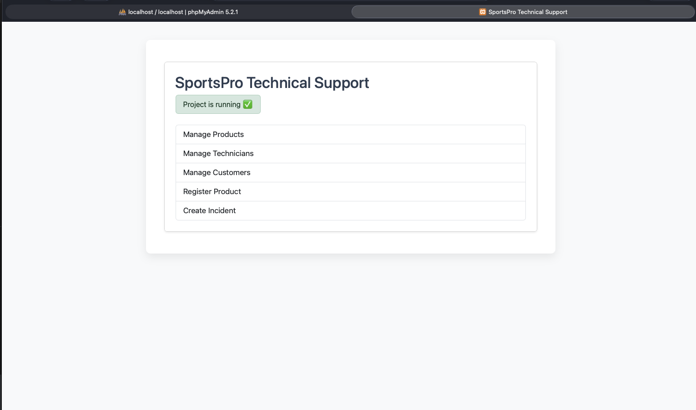
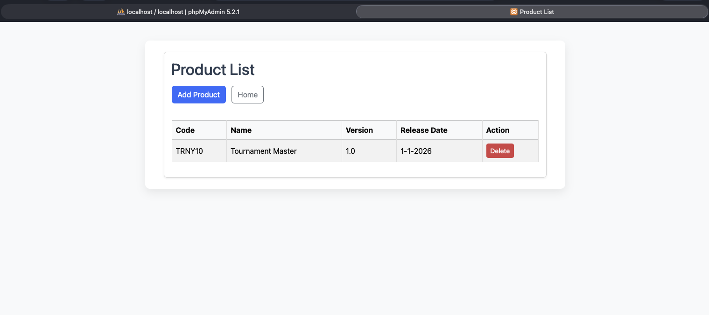
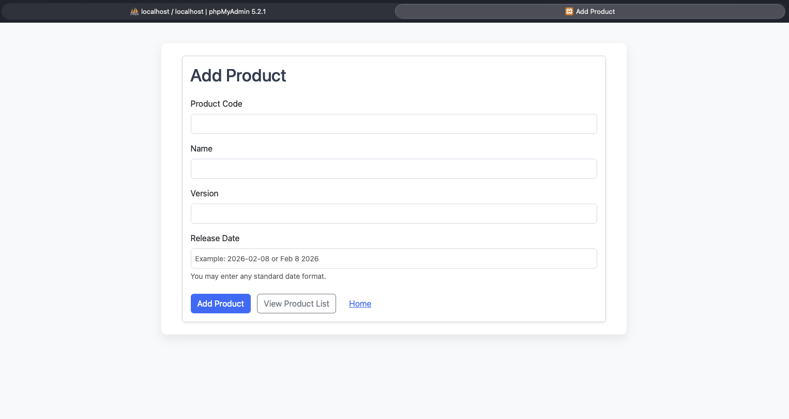
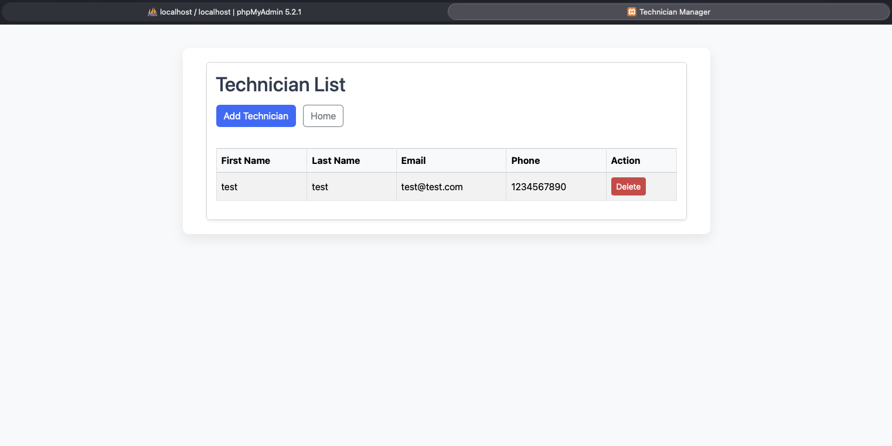
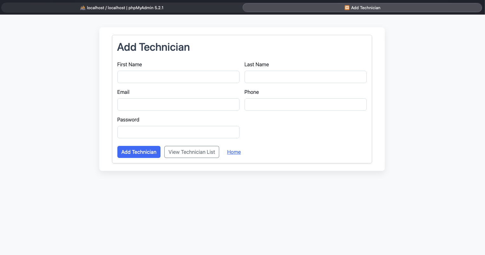
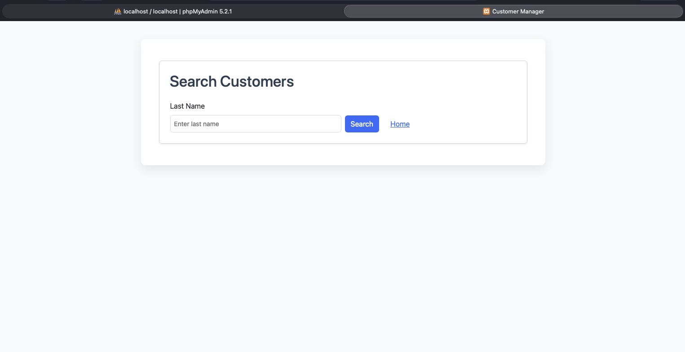
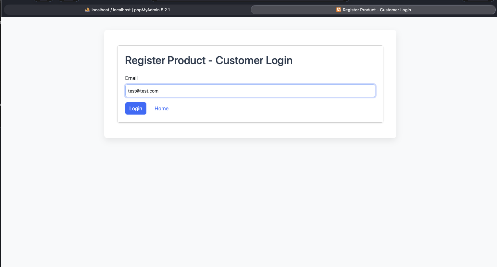
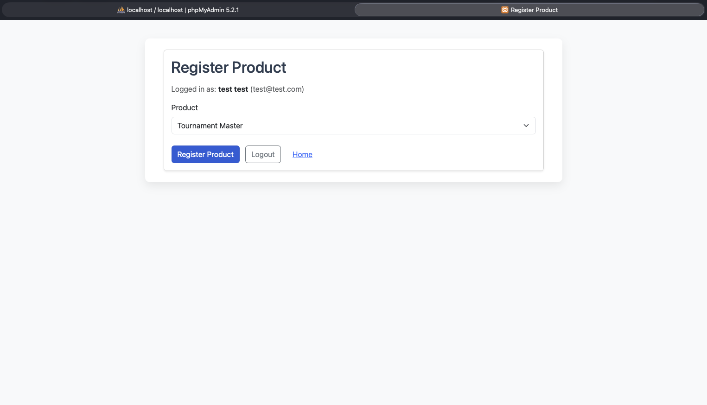
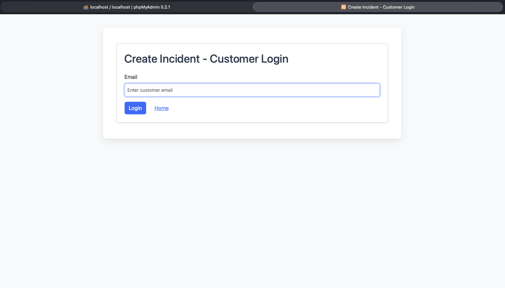

📘 PHPAssignment4 — SportsPro Technical Support System

👨‍💻 Author

Brijesh Patel
MWD4A — PHP & MySQL

⸻

📌 Project Overview

This project is a web-based Technical Support Management System built using:
	•	PHP (Procedural)
	•	MySQL (Database)
	•	Bootstrap 5 (UI Framework)
	•	XAMPP (Apache + MySQL)
	•	Git & GitHub (Version Control)

The system allows management of:
	•	Products
	•	Customers
	•	Technicians
	•	Product Registrations
	•	Incidents

This assignment builds on previous modules and progressively improves:
	•	Database integration
	•	Form validation
	•	Controller structure
	•	Date formatting
	•	Bootstrap UI enhancement

⸻

🧱 Technologies Used
	•	PHP 8+
	•	MySQL
	•	phpMyAdmin
	•	Bootstrap 5.3
	•	HTML5
	•	Git

📂 Project Structure

PHPAssignment4/
│
├── css/
│   └── main.css
│
├── customer_manager/
├── technician_manager/
├── product_manager/
├── product_register/
├── incident_create/
│
├── model/
│   ├── database.php
│   ├── customer_db.php
│   ├── product_db.php
│   ├── technician_db.php
│   ├── registration_db.php
│   ├── incident_db.php
│   └── country_db.php
│
├── errors/
│   └── error.php
│
├── db/
│   └── tech_support.sql
│
├── ScreenShots/
│   ├── 1.png
│   ├── 2.png
│   ├── ...
│
├── index.php
└── README.md

⸻

🗄 Database Setup

Step 1 — Import Database
	1.	Start XAMPP
	2.	Open phpMyAdmin
	3.	Create database: tech_support
  4.	Import file: db/tech_support.sql

  
⸻

▶️ How to Run the Project
	1.	Start Apache and MySQL in XAMPP
	2.	Place project in: /Applications/XAMPP/htdocs/PHPAssignment4
  3.	Open browser: http://localhost/PHPAssignment4/

⸻

📚 Features Implemented

✅ Product Manager
	•	View all products
	•	Add new product
	•	Delete product
	•	Release date formatting (Project 10-1)

✅ Customer Manager
	•	Search customer by last name
	•	Update customer information
	•	Country dropdown (Project 7-1)

✅ Technician Manager
	•	View technicians
	•	Add technician
	•	Delete technician

✅ Product Registration
	•	Customer login (email-based)
	•	Register products
	•	Prevent duplicate registration

✅ Incident Creation
	•	Customer login
	•	Create incident for registered products only
	•	Validation for required fields

⸻

🎨 UI Improvements (Assignment 4)
	•	Bootstrap 5 integration
	•	Responsive layout
	•	Styled tables
	•	Styled forms
	•	Alerts for messages
	•	Card layout for content sections

No business logic was modified during UI enhancement.

⸻

🧠 Architecture Improvements
	•	MVC-style structure
	•	Model files handle database operations
	•	Controller files manage actions
	•	Views render HTML
	•	Switch-based controller logic (Project 8-1)
	•	Date normalization using strtotime() (Project 10-1)

⸻

🎥 Project Demonstration Video

This video demonstrates the complete functionality of the SportsPro Technical Support System including:
• Admin Dashboard
• Product Management
• Customer & Technician Management
• Product Registration (Customer)
• Incident Creation & Assignment Workflow

🔗 Watch here:
https://youtu.be/xPUgDYFs2Ys

⸻

# 📷 Screenshots

## 1. Home Page

## 2. Product Manager

## 3. Add Product

## 4. Customer Search

## 5. Update Customer

## 6. Technician Manager

## 7. Product Registration

## 8. Incident Login

## 9. Create Incident

⸻

🔒 Validation & Security
	•	filter_input() used for sanitization
	•	htmlspecialchars() for XSS protection
	•	Basic required-field validation
	•	Duplicate registration prevention
	•	Server-side validation for forms

⸻

🚀 Next Improvements (Assignment 5)
	•	Session-based authentication (Project 12-1)
	•	Remove email passing in URLs
	•	Persistent login/logout functionality
	•	Additional workflow enhancements
	•	Incident assignment workflow (20-x / 21-x)
	•	Further validation improvements

⸻

📌 Notes
	•	This project is for academic use.
	•	Database name must remain: tech_support
  •	SQL dump included in /db folder.
